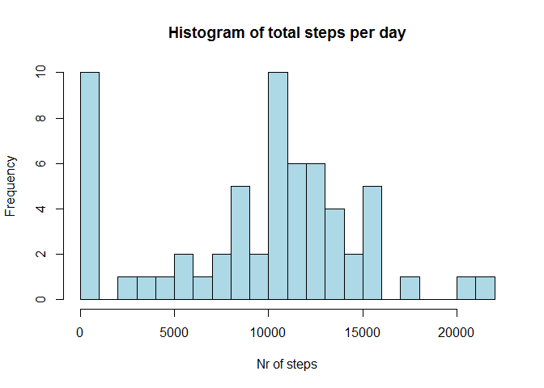
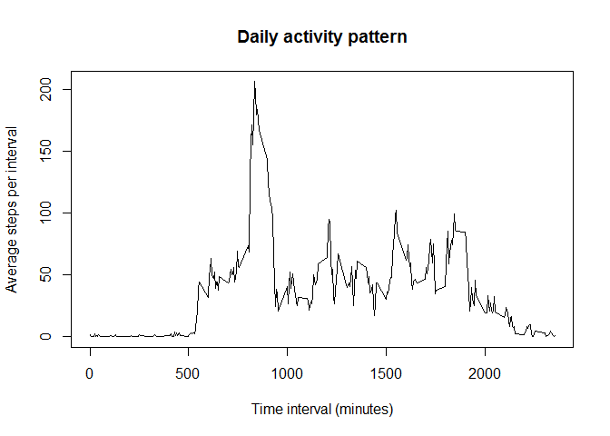
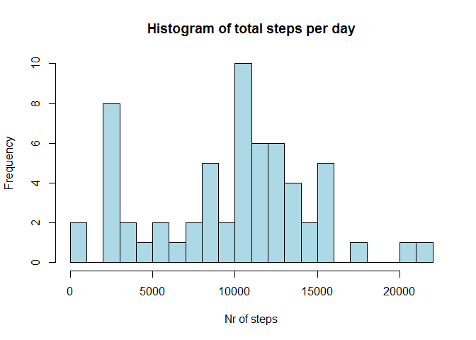
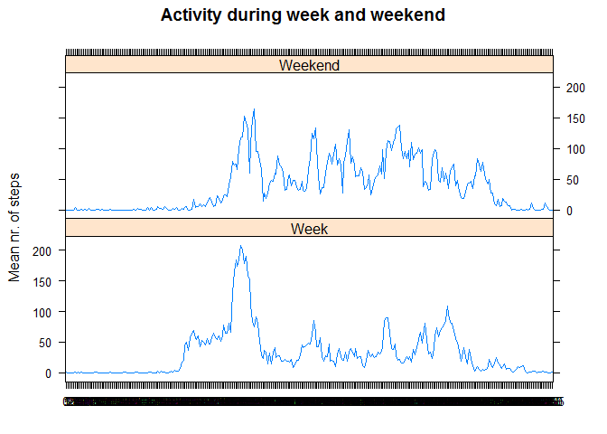

Reproducible Research: Peer Assessment 1
================

Loading and preprocessing the data
----------------------------------

Load plotting libraries and dataset

``` r
library(lattice) 
dataset <- read.csv('C:/Users/Kevin Verhaegh/Desktop/Reproducible data/Assignment 1/activity.csv')
```

What is mean total number of steps taken per day?
-------------------------------------------------

Determine total steps taken each day and plot data in histogram.

``` r
StepsPerDay <- tapply(dataset$steps, dataset$date, sum, na.rm = T) #calculate nr. of steps per day and ignorne NaNs
hist(StepsPerDay,breaks=20,main = 'Histogram of total steps per day', xlab = 'Nr of steps', col='lightblue') #make histogram of nr. of steps per day
```

<!-- -->

Determine mean and median of the total number of steps taken per day.

``` r
mean(StepsPerDay) # mean nr. of steps per day
```

    ## [1] 9354.23

``` r
median(StepsPerDay) # median number of steps per day
```

    ## [1] 10395

What is the average daily activity pattern?
-------------------------------------------

Average data over all days and determine number of steps per time interval (while ignoring NaNs)

``` r
StepsPerInterval <- tapply(dataset$steps, dataset$interval, mean, na.rm = T) #calculate mean nr. of steps per interval and ignorne NaNs
plot(StepsPerInterval ~ unique(dataset$interval), type = 'l', main = 'Daily activity pattern', xlab = 'Time interval (minutes)', ylab = 'Average steps per interval') #plot
```

<!-- -->

``` r
which.max(StepsPerInterval) #determine interval where activity is maximum
```

    ## 835 
    ## 104

The time interval at which the daily activity (average nr. of steps per interval) is maximum is at interval 835 (which corresponds to the interval of minutes 830 - 835)).

Imputing missing values
-----------------------

Get total number of Nas

``` r
TotNrNa <- sum(is.na(dataset$steps))
```

Clean up NaNs from data. Use the following algorithm. - Determine median nr. of steps per time interval for a given day of the week - For each NaN, replace the NaN with the median nr. of steps of the corresponding time interval and corresponding day of the week.

``` r
dataset$WeekDay <- weekdays(as.Date(dataset$date), abbreviate = FALSE) #append to data set the day of the week
dataset$WeekDay <- as.factor(dataset$WeekDay) #Express day of week as factor
dataset$interval <- as.factor(dataset$interval) #express interval as factor
StepsPerIntervalPWD <- with(dataset, tapply(steps, list(WeekDay, interval), median, na.rm = T)) #calculate median nr. of steps per interval per week day and ignorne NaNs
NewDataset <- dataset
for (i in 1:length(dataset$steps)){ #loop over all elements
  if (is.na(NewDataset$steps[i])){ #NaN detected
  IndxInterval = which(levels(NewDataset$interval) == dataset$interval[i]) #get index interval level
  IndxWeekDay = which(levels(NewDataset$WeekDay) == dataset$WeekDay[i]) #get index week day level
  NewDataset$steps[i] <- StepsPerIntervalPWD[IndxWeekDay, IndxInterval] #replace NaN
  }
  }
```

Are there differences in activity patterns between weekdays and weekends?
-------------------------------------------------------------------------

Calculate nr of steps per day, show histogram and calculate mean and median of nr. of steps per day.

``` r
StepsPerDay <- tapply(NewDataset$steps, dataset$date, sum) #calculate nr. of steps per day 
hist(StepsPerDay,breaks=20,main = 'Histogram of total steps per day', xlab = 'Nr of steps', col='lightblue') #make histogram of nr. of steps per day
```

<!-- -->

``` r
mean(StepsPerDay) # mean nr. of steps per day
```

    ## [1] 9705.238

``` r
median(StepsPerDay) # median number of steps per day
```

    ## [1] 10395

Comparing both histograms, many cases in which no steps per day have been detected are now shifted to cases where less than 5000 (but more than 0) steps were detected. This leads to a higher mean number of steps per day. Nevertheless, the median number of steps per day has not changed.The Na removal algorithm leads to a higher expected number of steps per day, since it recovers part of the number of steps performed on a day where before no number of steps were detected since at a substantial number of intervals Na was measured for that day.

Activity patterns between weekdays and days
===========================================

First, convert the current WeekDay factor to a two level factor (weekday or weekend)

``` r
NewDataset$Week <- NewDataset$WeekDay
levels(NewDataset$Week)[levels(NewDataset$Week) %in% c('Monday', 'Tuesday', 'Wednesday', 'Thursday', 'Friday')] <- 'Week'
levels(NewDataset$Week)[levels(NewDataset$Week) %in% c('Saturday', 'Sunday')] <- 'Weekend'
```

Make a panel plot with activity during the week and weekend

``` r
MeanStepsFrame <- with(NewDataset, aggregate(steps, list(Week, interval), mean))
xyplot(x ~ Group.2 | Group.1, data = MeanStepsFrame[order(MeanStepsFrame$Group.2),], type = 'l', main = 'Activity during week and weekend', 'xlab' = '', ylab = 'Mean nr. of steps', layout = c(1,2))
```

<!-- -->
